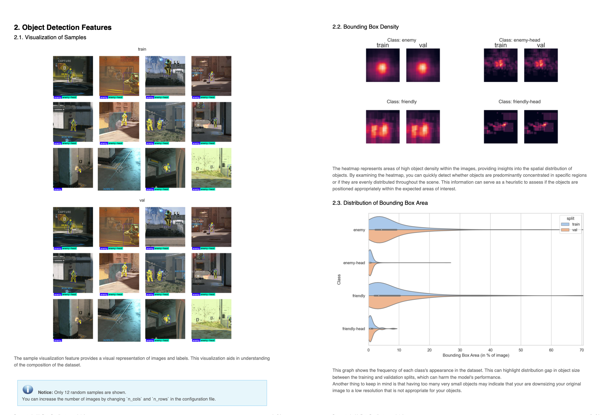

# Data-Gradients with Hugging Face Dataset
Just a little notebook made in a hurry showing you how to use [data-gradients](https://github.com/Deci-AI/data-gradients/tree/master) with [hugging face datasets](https://huggingface.co/docs/datasets/index)

This is a sample of the report it generates

I've also made a video